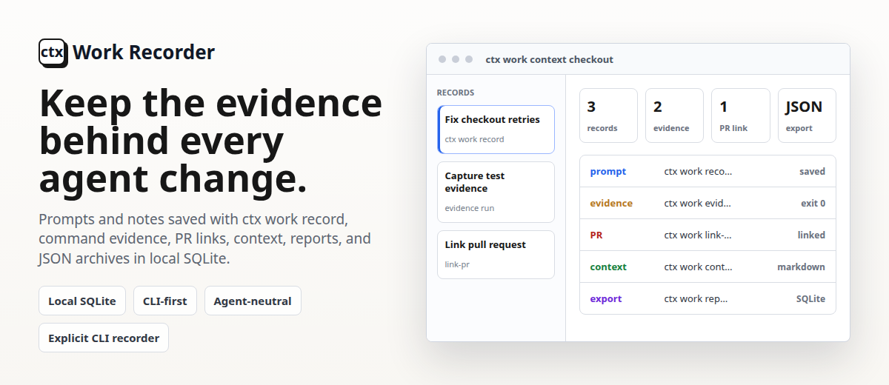

<p align="center">
  
</p>

ctx is being productized around **Work Records**: durable, local records of
agent-assisted work that can be searched, reviewed, exported, and later attached
to pull requests or team workflows.

This branch is an early local Work Recorder. It is useful today for explicit
records, command evidence, pull request links, search, reports, context output,
JSON export/import, local dashboard export, local capture spool import,
provider fixture import, VCS/PR inspection, local Git/jj/gh command shims, and
local storage validation. It is not yet the full passive recorder described in
the product direction.

## Current Status

Implemented in this branch:

- create local Work Records with title, body, tags, kind, optional workspace,
  timestamps, and id;
- capture command evidence when commands are run through `ctx evidence run`;
- install local reversible Git/jj/gh wrapper shims that spool command evidence;
- link one pull request URL to a record with `ctx link-pr`;
- list, show, search, and render context for local records;
- generate text or JSON reports from recent records and evidence;
- export a static local HTML dashboard;
- export/import ctx JSON archives;
- import pending local capture spool JSONL files;
- import normalized Codex, Claude, and Pi provider fixture JSONL into local
  summary records and rich capture data;
- automatically import pending capture spool files before normal work views;
- inspect Git/jj workspace metadata and parse GitHub/GitLab pull request URLs;
- validate, repair failed capture imports, and remove the local Work Recorder
  data store.

Not implemented yet:

- passive provider hooks or shell hooks beyond the local Git/jj/gh wrapper
  shims;
- scanning existing Codex, Claude, Cursor, or other local agent history
  directories;
- posting or updating pull request comments;
- hosted sync, hosted sharing, accounts, team policy, hosted dashboards,
  organization analytics, or hosted retention controls;
- public installer URLs for this branch;
- hosted publish commands such as `ctx publish`.

The implemented CLI now uses root-level Work Recorder commands. The older
`ctx workspace ...` and `ctx work ...` forms remain as hidden compatibility
aliases for the current local behavior.

## Install Or Run

Public installer URLs are not documented as live for this branch yet. Build or
install from this checkout:

```bash
cargo build -p ctx
cargo install --path crates/ctx-cli
```

You can also run commands from source:

```bash
cargo run -p ctx -- workspace status
cargo run -p ctx -- list
```

## Quick Start

Create the local Work Recorder store:

```bash
ctx setup
ctx status
```

Create a Work Record:

```bash
ctx record \
  --title "fix checkout retry handling" \
  --body "Investigate flaky checkout retries and make retry behavior deterministic." \
  --tag checkout \
  --tag retry \
  --kind task \
  --json
```

Capture command evidence:

```bash
ctx evidence run --record <record-id> cargo test -p checkout
```

Optionally capture local Git/jj/GitHub CLI commands without repo hooks:

```bash
ctx shim install --dir .ctx-shims
eval "$(ctx shim env --dir .ctx-shims)"
git status
ctx capture import
```

Link a pull request URL locally:

```bash
ctx link-pr <record-id> https://github.com/example/project/pull/42
```

Review and search:

```bash
ctx list
ctx show <record-id>
ctx search checkout
ctx context checkout
ctx report
ctx dashboard export --output ./work-record-dashboard
```

Inspect local repository metadata or parse a pull request URL:

```bash
ctx vcs inspect --json
ctx pr parse https://github.com/example/project/pull/42 --json
```

Move records between machines with ctx JSON archives:

```bash
ctx export --output work-records.json
ctx import --input work-records.json
```

`ctx import` imports ctx archive JSON only. It does not import existing
local agent history from provider transcript directories.

Import a normalized provider fixture:

```bash
ctx capture import-provider --provider codex --input tests/fixtures/provider/codex.jsonl --json
```

Provider fixture import currently supports `codex`, `claude`, and `pi` fixture
JSONL. It creates a summary Work Record for new imported sessions/events so the
content appears in search, context, report, and dashboard output.

Import pending local capture spool files:

```bash
ctx capture import --json
```

The capture importer reads JSONL envelope files from the local Work Recorder
inbox. The optional Git/jj/gh wrapper shims can write these envelopes for local
command-line activity. Provider-native transcript importers and shell hooks are
not implemented in this branch.

## Work Record Model

A Work Record is the durable history for one unit of agent-assisted work. The
current implementation stores:

- id;
- title;
- body;
- kind;
- tags;
- optional workspace path;
- optional pull request URL;
- created and updated timestamps;
- command evidence captured by `ctx evidence run`.

The near-term product direction is broader: Work Records should eventually
connect sessions, subagents, command evidence, tool output, files touched,
commits, pull requests, artifacts, summaries, decisions, and review notes. Those
larger objects are direction unless the CLI reference documents a shipped
command for them.

## CLI

The current command groups are:

```bash
ctx setup
ctx status
ctx uninstall --yes

ctx schema
ctx record --title "task title" --body "prompt or note" --kind task
ctx list
ctx show <record-id>
ctx search <query>
ctx context [query]
ctx report
ctx dashboard export --output <dir>
ctx evidence run [--record <record-id>] <command> [args...]
ctx shim install --dir <dir>
ctx shim env --dir <dir>
ctx shim uninstall --dir <dir>
ctx capture import [--json]
ctx capture import-provider --provider codex|claude|pi --input <path> [--json]
ctx vcs inspect [path] [--json]
ctx pr parse <pull-request-url> [--json]
ctx link-pr <record-id> <pull-request-url>
ctx export [--output work-records.json]
ctx import [--input work-records.json] [--overwrite]
ctx validate
ctx doctor [--privacy]
ctx repair [--json]
```

See [docs/cli-reference.md](docs/cli-reference.md) for the detailed current
command reference.

Small local dogfood workflows live in [examples/](examples/):

- [examples/local-record-workflow.sh](examples/local-record-workflow.sh) creates
  a temporary data root, records work, captures command evidence, searches,
  renders context, exports, and validates storage.
- [examples/capture-spool-fixture.sh](examples/capture-spool-fixture.sh) writes
  a fixture capture envelope to the local spool and imports it.

The examples default to temporary data roots under `target/tmp`. Set
`CTX_BIN` to use an already-built `ctx` binary, `CTX_EXAMPLE_DATA_ROOT` to reuse
a specific example data root, or `CTX_EXAMPLE_TMPDIR` to move temporary roots.

## Storage

By default, ctx uses machine-local storage under:

```text
~/.ctx/work-record/
  work.sqlite
  blobs/
  inbox/
```

Set `CTX_DATA_ROOT` to use a different root. The current implementation stores
records, imported provider fixture summaries, and imported command evidence in
SQLite, full evidence payloads in local blob files, and pending passive
captures in a JSONL inbox. Provider-history directory scanners and broader
passive normalization pipelines remain product direction.

No account is required. No hosted sync runs in this branch. Exported JSON files
should be reviewed before they leave your machine because records and command
output can contain source code, prompts, paths, secrets, or customer data.

For the launch security boundary, see [SECURITY.md](SECURITY.md) and the
[Work Recorder threat model](docs/threat-model.md). Hosted/team Option A is not
part of this branch's launch scope.

## Product Direction

The Work Recorder direction remains local-first:

- Work Records should be valuable without adopting a special agent runtime.
- Local recording should not require a hosted account.
- Passive capture should be conservative and should not break the wrapped tool
  if capture fails.
- Hosted sync should not upload raw transcripts by default; full transcript sync
  should be explicit opt-in.
- Pull request publishing should eventually upsert a separate ctx comment by
  default instead of mutating the PR description.
- Inferred links between records, repos, commits, and PRs should be confidence
  labeled rather than presented as facts.

These are product constraints for upcoming work, not claims that all of the
behavior exists today.

Dependency and license audit decisions for the source-build launch branch are
tracked in
[docs/dependency-license-audit.md](docs/dependency-license-audit.md). Public
installer or updater documentation should not be added until that gate is
complete.

## Build From Source

Prerequisites:

- Rust stable
- a normal local C/C++ build toolchain for your platform

Build and test:

```bash
cargo build --workspace
cargo test --workspace --all-targets
```

Run the repository check script:

```bash
./scripts/check.sh
```

If Bazel is installed:

```bash
./scripts/bazel-test.sh
bazel test //...
```
