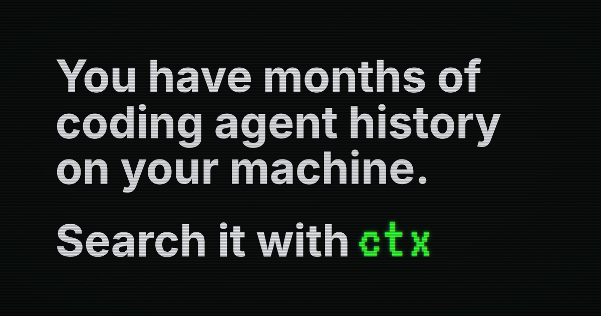

ctx is an open-source CLI for fast local search across your past coding agent sessions.

Coding agents usually start from zero. They can inspect the current repo, but they often cannot recover the discussions, decisions, failed attempts, commands, and test results from earlier work.

Those sessions are full of useful context:

- decisions, constraints, intent, and rejected approaches from you
- bug investigations, refactors, file paths, commands, patches, and notes from previous agents

ctx indexes those logs into SQLite on your machine, then gives current and future agents a CLI for finding the prior discussion, command, or failed attempt before they repeat it.

## Install and set up ctx

```bash
curl -fsSL https://ctx.rs/install | sh
```

Optional but recommended for agent sessions:

```bash
ctx skill install
```

For marketplace/plugin installs in Codex, Claude Code, Cursor, and raw Agent
Skills, see [Agent Skill Install](docs/agent-skill-install.md).

## 50x more token-efficient than raw transcript search

By structuring agent history into sessions, events, metadata, and indexed fields, then returning ranked cited matches, agents can access meaningful history with far fewer tokens than raw search. Results vary by query and corpus, but raw search is often so token-heavy that it can be effectively the same as not having usable history.


## How it works

Your past agent sessions are stored in local provider history files. ctx discovers supported sources, imports the real persisted records, and stores normalized session, event, and touched-file metadata in a local SQLite database optimized for retrieval.

ctx is written in Rust and stores a local SQLite index, so searches are fast, scriptable, and do not require a background service.

The index is local and private by default. Transcript text is preserved rather than hiding local paths or secret-shaped strings, so review copied output before sharing it outside the machine.

```bash
# Index all of your existing local agent sessions
ctx setup

# Your agent can search prior work with normal language
ctx search "failed migration"

# Search sessions/events that touched a file
ctx search --file crates/foo/src/lib.rs

# Or search multiple terms
ctx search --term "failed migration" --term rollback --term "cursor rename"

# Advanced: inspect exact local index data with read-only SQL
ctx sql "SELECT provider, COUNT(*) AS sessions FROM ctx_sessions GROUP BY provider"

# Results include matching sessions, snippets, and ctx IDs
# evt_01h...  ses_01h...  codex  "migration expected the old cursor name" ...

# Print the matching part of the old transcript
ctx show event <ctx-event-id> --window 3

# Or print a compact transcript of the original session
ctx show session <ctx-session-id>
```

Those IDs let your current agent recover as much context from previous sessions as it needs.

ctx does not send your prompts, transcripts, or indexed history to a cloud service, call model APIs, require API keys, or write into your source repositories.

The installed binary also includes local docs and man-page generation:

```bash
ctx docs search "upgrade"
ctx docs show cli-reference
ctx docs man --print ctx
```

Official installer-managed binaries support signed self-upgrades:

```bash
ctx upgrade status
ctx upgrade check
```

Source builds and package-manager installs remain unmanaged and do not self-upgrade.

For the full pipeline, see [How ctx works](https://ctx.rs/concepts/how-it-works). For a quick first run, see [Quickstart](https://ctx.rs/first-search).

## Supported agent histories

Support means ctx can discover or read that harness's persisted local history and import it into the local search index. Use `ctx sources --json` on your machine to see which sources are currently `importable`.

| Agent harness | Support |
| --- | --- |
| Claude Code | Supported |
| Codex | Supported |
| Cursor | Supported |
| Pi | Supported |
| GitHub Copilot CLI | Supported |
| OpenCode | Supported |
| Gemini CLI / Antigravity | Supported |
| Factory AI Droid | Supported |
| OpenClaw | Supported |
| Hermes Agent | Supported |
| AstrBot | Supported |
| NanoClaw | Supported |
| Shelley | Supported |
| Auggie / Augment | Supported |
| Cline / Roo Code | Supported |
| CodeBuddy | Supported |
| Continue | Supported |
| Crush | Supported |
| Deep Agents | Supported |
| Firebender | Supported |
| ForgeCode | Supported |
| Goose | Supported |
| Junie | Supported |
| Kilo Code | Supported |
| Kimi Code CLI | Supported |
| Kiro CLI | Supported |
| Lingma | Supported |
| Mistral Vibe | Supported |
| Mux | Supported |
| OpenHands | Supported |
| Qoder | Supported |
| Qwen Code | Supported |
| Rovo Dev | Supported |
| Tabnine CLI | Supported |
| Trae / Trae CN | Supported |
| Warp | Supported |
| Windsurf | Supported |
| Zed | Supported |

## How ctx compares

Agent memory tools usually save compact facts, summaries, vectors, or graph nodes. Those can help with stable preferences, but they are weak evidence when the next agent needs to know where a decision came from, what command failed, or what was rejected in the original conversation.

Graphify-style tools answer a different question. They map the current repository: files, symbols, imports, folders, and relationships. ctx searches the prior agent sessions that explain what happened while people and agents changed that repository.

ctx keeps retrieval tied to sessions and events, so another agent can inspect the source before using it. Read more about [agent memory](https://ctx.rs/comparisons/agent-memory), [Graphify-style codebase graphs](https://ctx.rs/comparisons/codebase-graphs), and [grep or log search](https://ctx.rs/comparisons/grep-log-search).

## Explore the docs

| Page | What it covers |
| --- | --- |
| [Install](https://ctx.rs/getting-started/install) | Install ctx, initialize local storage, and index discovered local history. |
| [Quickstart](https://ctx.rs/first-search) | Search local history, inspect an event, open the session, and use JSON output. |
| [Install the ctx skill](https://ctx.rs/skill) | Install the agent-history search skill with the open skills installer. |
| [Package managers and unmanaged installs](docs/unmanaged-installs.md) | Install from GitHub Releases, mise, Homebrew, or source builds. |
| [Agent plugin installs](docs/agent-skill-install.md) | Install the ctx skill through Codex, Claude Code, Cursor, or a raw skill folder. |
| [SDKs](docs/sdks.md) | Use ctx agent history search from TypeScript, Python, Rust, Go, JVM, Swift, or .NET code. |
| [Custom history plugins](docs/history-source-plugins.md) | Build an advanced local adapter for agent formats ctx does not support natively. |
| [Cursor](https://ctx.rs/agents/cursor) | Import Cursor agent transcripts and ask Cursor to cite retrieved local history before editing. |
| [How it works](https://ctx.rs/concepts/how-it-works) | Understand discovery, import, SQLite storage, search refresh, and cited retrieval. |
| [Supported agents](https://ctx.rs/concepts/supported-agents) | See which agent histories ctx can discover, import, and search today. |
| [CLI reference](https://ctx.rs/reference/cli) | Review setup, status, sources, import, show, locate, search, SQL, MCP, and doctor. |
